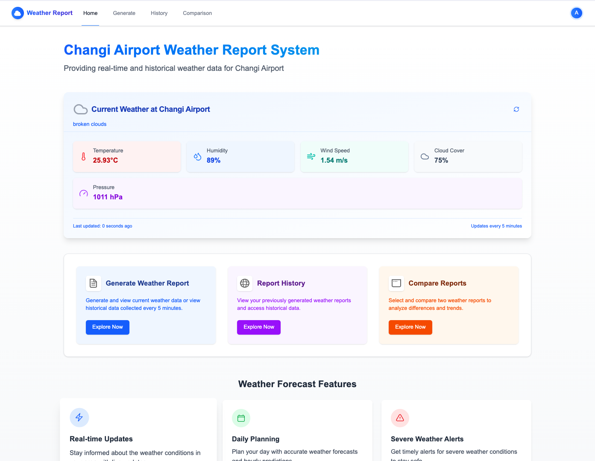

# Changi Airport Weather Report System (Scanner)

A comprehensive full-stack application for monitoring, analyzing, and comparing weather data at Changi Airport, Singapore (Latitude: 1.3586° N, Longitude: 103.9899° E).



## Overview

This system fulfills the requirements of the Scanner Technical Assessment, providing a robust solution for real-time and historical weather monitoring at Changi Airport. The application enables users to generate reports of current weather conditions, store these reports for future reference, and perform comparative analysis between different time periods.

## Key Features

- **Weather Data Collection**: Automated retrieval of weather metrics from OpenWeather API
- **Report Generation**: On-demand creation of weather reports with key metrics
- **Historical Data**: Browsing and filtering of previously generated reports
- **Comparison Tools**: Side-by-side comparison of reports with deviation calculation
- **User Authentication**: Secure login and account management for personalized experience

## Assessment Requirements Implementation

| Requirement                     | Implementation                                                  |
| ------------------------------- | --------------------------------------------------------------- |
| **Weather Report Generation**   | ✅ UI for generating reports for current or selected timestamps |
| **History Page**                | ✅ Tabular view with timestamp and all required metrics         |
| **Comparison Page**             | ✅ Side-by-side comparison with deviation calculations          |
| **OpenWeather API Integration** | ✅ Secure backend integration with error handling               |
| **Data Storage**                | ✅ Efficient MongoDB time-series collections                    |
| **Navigation & UX**             | ✅ Intuitive navigation with loading states                     |

## System Architecture

The system follows a modern full-stack architecture, leveraging:

```
┌─────────────────┐     ┌─────────────────┐     ┌─────────────────┐
│  OpenWeather    │     │  Backend API    │     │    Frontend     │
│      API        │◄────┤  (GraphQL)      │◄────┤  (Next.js)      │
└─────────────────┘     └───────┬─────────┘     └─────────────────┘
                               │
                      ┌────────▼────────┐
                      │    MongoDB      │
                      │  (Time Series)  │
                      └─────────────────┘
```

For detailed implementation information, please refer to:

- [Backend Documentation](./backend/README.md)
- [Frontend Documentation](./frontend/README.md)

### Technology Stack

#### Frontend

- **Next.js** with React for server-rendered UI
- **Apollo Client** for GraphQL data fetching
- **Tailwind CSS** for responsive design
- **TypeScript** for type safety

#### Backend

- **Node.js** with Express
- **GraphQL** with Apollo Server
- **MongoDB** with time-series collections
- **Prisma ORM** for database access
- **JWT** for authentication

## Getting Started

### Prerequisites

- Node.js (v16+)
- MongoDB (v5+ with time series collections support)
- OpenWeather API key (sign up at [OpenWeather](https://openweathermap.org/))

### Quick Start

1. **Clone the repository**

   ```bash
   git clone https://github.com/yourusername/weather_report.git
   cd weather_report
   ```

2. **Set up the backend**

   ```bash
   cd backend
   npm install

   # Configure environment variables (see below)

   # Generate Prisma client
   npx prisma generate

   # Seed the database with test users and sample data
   npm run db:seed
   # or
   yarn db:seed

   # Start the server
   npm run dev
   # or
   yarn dev
   ```

3. **Set up the frontend**

   ```bash
   cd ../frontend
   npm install

   # Configure environment variables (see below)
   # Then start the development server
   npm run dev
   # or
   yarn dev
   ```

4. **Access the application**
   - Frontend: http://localhost:3000
   - GraphQL API: http://localhost:4000/graphql
5. **Login with seed accounts**

   You can log in with any of the following pre-configured accounts:

   | Email             | Password     | Role                    |
   | ----------------- | ------------ | ----------------------- |
   | admin@weather.com | Password123! | Admin                   |
   | user@weather.com  | Password123! | User                    |
   | demo@weather.com  | Password123! | User (with sample data) |

### Environment Configuration

#### Backend (.env)

```
DATABASE_URL="mongodb://localhost/weather_report_development?directConnection=true"
SECRET1="your_secret_key_1"
SECRET2="your_secret_key_2"
JWT_SECRET="your_jwt_secret"
FRONTEND_URL="http://localhost:3000"
PORT=4000
NODE_ENV="development"
OPEN_WEATHER_API_KEY="your_openweather_api_key"
EMAIL_HOST="smtp.ethereal.email"
EMAIL_PORT=587
EMAIL_USER=""
EMAIL_PASS=""
EMAIL_FROM="noreply@weatherreport.com"
```

#### Frontend (.env.local)

```
NEXT_PUBLIC_API_URL=http://localhost:4000/graphql
```

## Project Structure

The project is organized into two main directories:

- **[Backend](./backend/README.md)**: Node.js/GraphQL server with MongoDB
- **[Frontend](./frontend/README.md)**: Next.js/React application

Each directory has its own detailed README with specific implementation details.

## Technical Documentation

### Project Approach

This implementation follows modern web development practices with a focus on:

1. **Type Safety**: TypeScript throughout the codebase ensures type safety and improves developer experience
2. **Component-Based Architecture**: Modular components for UI and backend services
3. **API-First Design**: GraphQL schema defines the contract between frontend and backend
4. **Automated Data Collection**: Background jobs ensure consistent weather data collection

### Additional Features

Beyond the core requirements, the implementation includes:

#### Enhanced Security

- JWT-based authentication
- HTTP-only cookies for token storage
- Password hashing with bcrypt
- Rate limiting for API endpoints
- Input validation with Zod

#### Performance Optimizations

- MongoDB time-series collections for efficient temporal data storage
- GraphQL data loaders for batching and caching
- Apollo Client cache for reduced network requests
- Server-side rendering for improved initial load time

#### Developer Experience

- Comprehensive TypeScript types
- Modular code structure
- Detailed documentation
- Consistent code style and formatting

#### User Experience

- Responsive design for all device sizes
- Intuitive navigation
- Loading states and error handling
- Form validation and feedback

## Testing

The project includes comprehensive testing for both frontend and backend:

### Backend Tests

Backend uses Jest and supertest for testing:

- **Unit tests**: Testing GraphQL resolvers, controllers, and services
- **Integration tests**: Testing integration flow from API to database
- **API Client Tests**: Testing integration with OpenWeather API

#### Running Backend Tests

```bash
# Navigate to backend directory
cd backend

# Install dependencies
yarn install
# or
npm install

# Run all tests
yarn test
# or
npm test

# Run specific test
yarn test src/api/openweather/__tests__/client.test.ts
```

### Frontend Tests

Frontend uses Jest and React Testing Library:

- **Component tests**: Testing React components like WeatherCard, WeatherDisplay...
- **Logic tests**: Testing custom hooks and utilities
- **Mock tests**: Testing with mock data for GraphQL and context APIs

#### Running Frontend Tests

```bash
# Navigate to frontend directory
cd frontend

# Install dependencies
yarn install
# or
npm install

# Run all tests
yarn test
# or
npm test

# Run tests in watch mode
yarn test:watch
# or
npm run test:watch

# Run specific test
yarn test src/components/weather/__tests__/WeatherDisplay.test.tsx
```

### Test Structure

#### Backend test structure:

```
backend/
  ├── src/
  │   ├── api/
  │   │   └── openweather/
  │   │       └── __tests__/
  │   │           └── client.test.ts
  │   ├── graphql/
  │   │   └── resolvers/
  │   │       └── __tests__/
  │   │           └── weather.test.ts (planned)
  │   └── ...
  ├── jest.config.js
  └── jest/
      └── setup.ts
```

#### Frontend test structure:

```
frontend/
  ├── src/
  │   ├── components/
  │   │   └── weather/
  │   │       └── __tests__/
  │   │           ├── WeatherCard.test.tsx
  │   │           └── WeatherDisplay.test.tsx
  │   ├── hooks/
  │   │   └── __tests__/
  │   │       └── useWeatherData.test.ts (planned)
  │   └── ...
  ├── jest.config.js
  └── jest.setup.js
```

### Testing Notes

- **TypeScript Configuration**: The TypeScript configuration files (`tsconfig.json`) have been set up to ignore test files, ensuring the build process is not affected by test files
- **Mocks**: External modules like Apollo Client and context APIs are mocked for independent testing
- **API Integration**: API services are mocked to enable testing without actual connections

## Seed Users

The application comes with pre-configured seed users for easier testing and development. After setting up the backend, you can run the database seed command to create these users:

```bash
cd backend
yarn db:seed
# or
npm run db:seed
```

### Default Users

| Email             | Password     | Role  | Description                             |
| ----------------- | ------------ | ----- | --------------------------------------- |
| admin@weather.com | Password123! | Admin | Administrator account with full access  |
| user@weather.com  | Password123! | User  | Standard user account                   |
| demo@weather.com  | Password123! | User  | Demo account with pre-populated reports |

These accounts provide different levels of access to the system:

- **Admin**: Can manage users, view all reports, and access system settings
- **User**: Can create reports, view their own history, and make comparisons
- **Demo**: Similar to User but has pre-generated weather reports for demonstration

### Seed Data

The seed script also creates:

- 10 historical weather reports for the demo user
- System settings configuration
- Example comparison presets

You can modify the seed data by editing the file at `backend/src/database/seed.ts`.

## Future Enhancements

The system is designed to be extensible for future requirements:

1. **Administrative Dashboard**: User management and system monitoring
2. **Extended Metrics**: Additional weather data points beyond the core requirements
3. **Subscription Model**: Premium features for paid users
4. **Mobile Applications**: Native mobile apps for iOS and Android
5. **Advanced Analytics**: Statistical analysis and weather prediction
6. **Containerization**: Docker setup for easier deployment
7. **Cloud Deployment**: AWS/GCP/Azure deployment configurations

## Contribution Guidelines

1. Fork the repository
2. Create a feature branch
3. Make your changes
4. Submit a pull request

## License

This project is proprietary and confidential.

---
